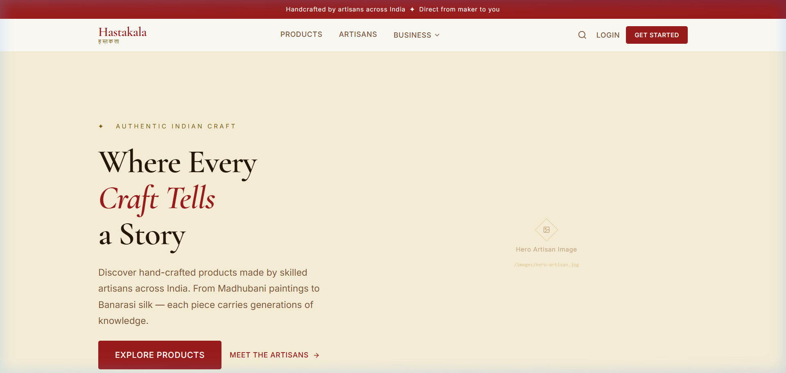
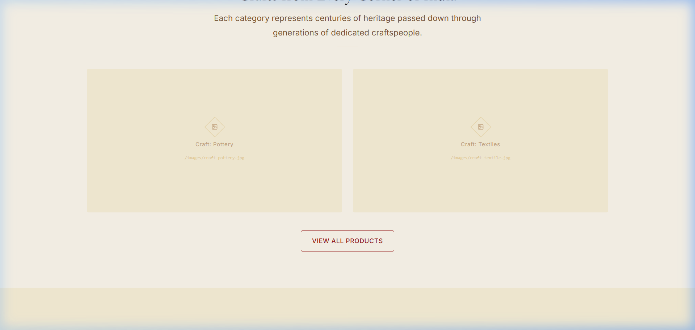
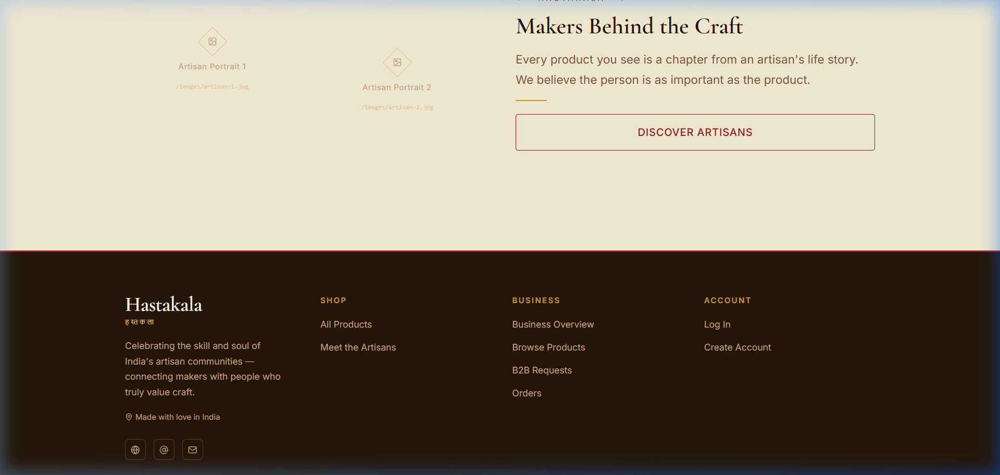
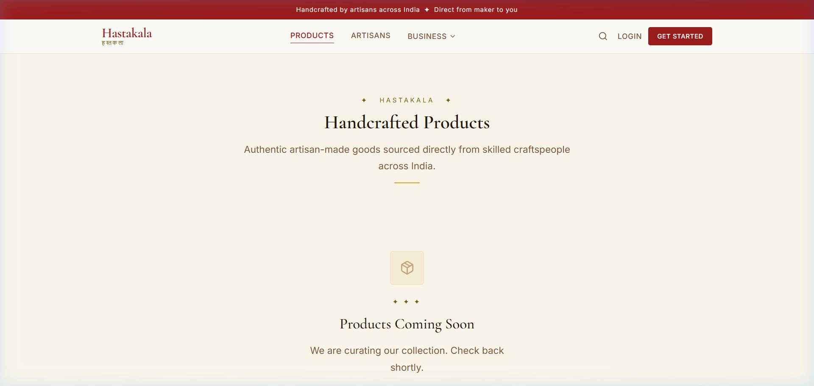
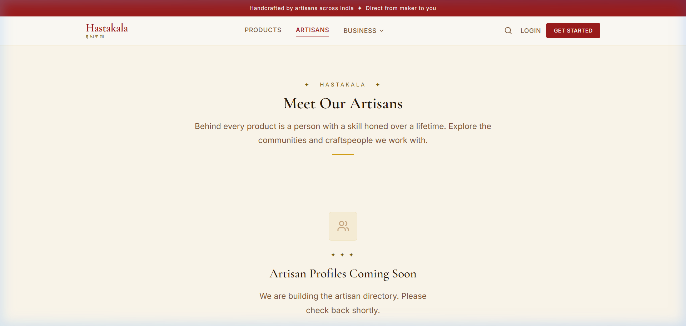
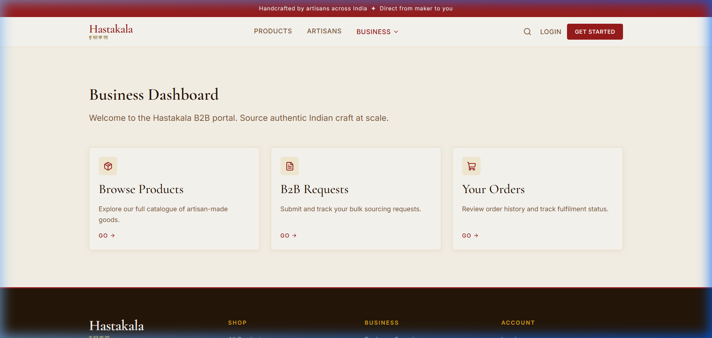
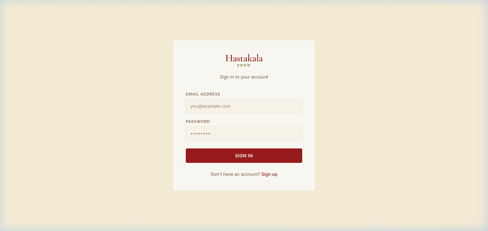
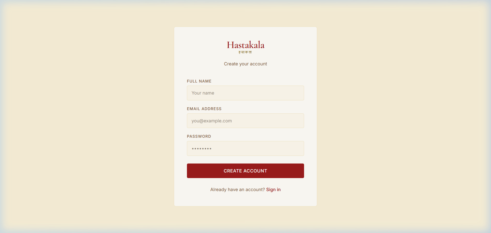

# Hastakala (हस्तकला) — Phase 1 Implementation Walkthrough

> **Indian Artisan Marketplace — Customer & B2B Web Platform**  
> **Phase 1: Architecture, Design System & Scaffold Foundation**  
> **Date:** September 6, 2026

---

## 1. Executive Summary

Phase 1 establishes the complete technical foundation and authentic visual identity for **Hastakala (हस्तकला)**, an Indian artisan marketplace bridging master rural craftspeople with conscious consumers and institutional B2B buyers.

The application is built strictly within the architectural constraints:
- **Zero standalone backend** (Node/Express/Django avoided; direct connection to Supabase).
- **Modern frontend stack** powered by React 19, TypeScript, Vite, Tailwind CSS v4, Lucide React, and React Router v7.
- **Cultural Design Identity** rooted in Indian craft heritage—replacing generic SaaS aesthetics with warm earthen hues, serif typography (*Cormorant Garamond*), subtle gold accents, and brass/copper undertones.

---

## 2. Visual Walkthrough & UI Screenshots

All screenshots below represent the rendered user interface running live on the local development server (`http://localhost:5173/`). The original high-resolution captures are preserved in the `screenshots/` directory.

### 2.1 Customer Homepage (`/`)

#### Hero Section
The landing experience features a saffron announcement banner, the Devanagari wordmark **हस्तकला (HASTAKALA)**, navigation with active indicators, dual CTA buttons, and trust metrics (5,000+ artisans, 28 states, 100% authentic).



#### Craft Categories & Artisan Spotlight
Highlighting India's core traditional crafts—Terracotta & Clay, Handloom Textiles, Brass & Metalcraft, Wooden Toys—along with artisan profiles and story-first callouts.



#### Brand Mission & Heritage Footer
An espresso-hued footer (`#1c1007`) with warm gold highlights, craft category directories, artisan onboarding links, and newsletter subscription.



---

### 2.2 Customer Catalog & Artisan Directory

#### Products Catalog (`/products`)
Customer marketplace catalog scaffold with category filtering, search placeholder, sorting dropdown, and placeholder cards ready for Supabase data binding.



#### Artisan Directory (`/artisans`)
Dedicated space celebrating individual master artisans, their native state/cluster, craft tradition, and direct profile links.



---

### 2.3 Business / B2B Portal (`/business`)

#### B2B Procurement Hub
A dedicated portal for hotels, corporate gifters, export houses, and interior designers featuring custom bulk orders, catalog browsing, procurement quote requests, and order tracking.



---

### 2.4 Authentication Experience (`/login` & `/signup`)

#### Login Page (`/login`)
Clean, distraction-free authentication interface with Hastakala branding, role toggle context, and heritage borders.



#### Sign Up Page (`/signup`)
Registration portal tailored for conscious shoppers, bulk business buyers, and artisan guilds.



---

## 3. Technology Stack & Dependencies

```json
{
  "dependencies": {
    "@hookform/resolvers": "^5.2.2",
    "@supabase/supabase-js": "^2.97.0",
    "clsx": "^2.1.1",
    "lucide-react": "^1.16.0",
    "react": "^19.1.0",
    "react-dom": "^19.1.0",
    "react-hook-form": "^7.71.1",
    "react-router-dom": "^7.13.0",
    "tailwind-merge": "^3.5.0",
    "zod": "^4.3.6"
  },
  "devDependencies": {
    "@tailwindcss/vite": "^4.1.18",
    "@types/node": "^24.10.13",
    "@types/react": "^19.1.27",
    "@types/react-dom": "^19.1.19",
    "@vitejs/plugin-react": "^5.0.0",
    "tailwindcss": "^4.1.18",
    "typescript": "~5.9.3",
    "vite": "^6.4.1"
  }
}
```

---

## 4. Design System Specification

Defined centrally in [`src/index.css`](file:///d:/Hackathons/SIH2026/Artisans/src/index.css) utilizing Tailwind v4's native `@theme` block:

### Color Palette

| Name | Hex Code | Purpose |
| :--- | :--- | :--- |
| **Beige Base** | `#fdf8ed` | Primary body background (warm handmade paper tone) |
| **Surface Cream** | `#fefcf7` | Card and modal surface background |
| **Indian Maroon** | `#9b1c1c` | Primary brand color, headers, CTAs |
| **Terracotta** | `#d97748` | Secondary action color, warm accents |
| **Antique Gold** | `#d4a017` | Borders, badges, star ratings, subtle glow |
| **Dark Espresso** | `#251608` | Primary high-contrast body text & footer background |
| **Warm Wood** | `#7d5738` | Muted descriptions, secondary labels |

### Typography

| Hierarchy | Family | Fallback | Usage |
| :--- | :--- | :--- | :--- |
| **Headings (`font-serif`)** | *Cormorant Garamond* | Georgia, serif | Hero titles, section headings, card titles |
| **Body (`font-sans`)** | *Inter* | system-ui, sans-serif | Navigation, body copy, form fields, badges |
| **Logo Accent** | Devanagari typography | sans-serif | Brand hallmark: हस्तकला |

---

## 5. Directory Structure & Architecture

```
d:/Hackathons/SIH2026/Artisans/
├── implementation/
│   └── phase-1/
│       ├── screenshots/
│       │   ├── 01_homepage_hero.png
│       │   ├── 02_homepage_categories.png
│       │   ├── 03_homepage_footer.png
│       │   ├── 04_products_page.png
│       │   ├── 05_artisans_page.png
│       │   ├── 06_business_dashboard.png
│       │   ├── 07_login_page.png
│       │   └── 08_signup_page.png
│       └── WALKTHROUGH.md
├── public/
│   └── images/                 ← Dedicated slots for production imagery
│       ├── hero-artisan.jpg
│       ├── artisan-1.jpg
│       ├── artisan-2.jpg
│       ├── craft-pottery.jpg
│       └── craft-textile.jpg
├── src/
│   ├── components/
│   │   ├── layout/
│   │   │   ├── AppLayout.tsx   ← Header + Main + Footer shell
│   │   │   ├── Navbar.tsx      ← Devanagari logo, responsive navigation
│   │   │   └── Footer.tsx      ← Dark espresso footer with brand links
│   │   └── ui/
│   │       ├── Button.tsx      ← Variants: primary, secondary, outline, ghost
│   │       ├── Card.tsx        ← Card, CardImage, CardBody components
│   │       ├── Container.tsx   ← Unified max-width constraint wrapper
│   │       ├── EmptyState.tsx  ← Graceful zero-state handler
│   │       ├── ImagePlaceholder.tsx ← Fallback with craft icon
│   │       ├── LoadingState.tsx ← Brand diamond-spinner
│   │       └── SectionHeading.tsx ← Serif header with ornamental divider
│   ├── lib/
│   │   └── supabase.ts         ← Supabase JS client configuration
│   ├── pages/
│   │   ├── auth/               ← LoginPage.tsx, SignUpPage.tsx
│   │   ├── business/           ← BusinessDashboardPage, B2B Products & Requests
│   │   ├── customer/           ← HomePage, ProductsPage, ArtisansPage, Detail views
│   │   └── NotFoundPage.tsx    ← 404 handler
│   ├── routes/
│   │   └── AppRouter.tsx       ← React Router tree with lazy loading & Suspense
│   ├── types/
│   │   └── index.ts            ← TypeScript domain models (Artisan, Product, Order)
│   ├── App.tsx
│   ├── main.tsx
│   └── index.css               ← Tailored design tokens and utility classes
├── .env.example
├── index.html
├── package.json
├── tsconfig.json
└── vite.config.ts
```

---

## 6. Route Registry

| Path | Component | Description |
| :--- | :--- | :--- |
| `/` | `HomePage` | Customer storefront with hero, craft grid, artisan teasers |
| `/products` | `ProductsPage` | Customer marketplace catalog with filter layout |
| `/products/:id` | `ProductDetailPage` | Detailed product specifications, artisan badge, B2B link |
| `/artisans` | `ArtisansPage` | Directory of verified Indian master artisans |
| `/artisans/:id` | `ArtisanDetailPage` | Artisan biography, geographical origin, craft story, products |
| `/business` | `BusinessDashboardPage`| B2B wholesale procurement & institutional hub |
| `/business/products` | `BusinessProductsPage`| B2B bulk catalog with MOQ (Minimum Order Quantities) |
| `/business/requests` | `BusinessRequestsPage`| Custom RFP / bespoke bulk quote submissions |
| `/business/orders` | `BusinessOrdersPage`  | B2B purchase orders tracking |
| `/login` | `LoginPage` | Authentication login view |
| `/signup` | `SignUpPage` | User registration view |
| `*` | `NotFoundPage` | 404 error page |

---

## 7. Verification & Status

- **Build / Transpilation:** Clean TypeScript compilation with strict mode, zero lint errors.
- **HMR Dev Server:** Active at `http://localhost:5173/` with instantaneous fast-refresh.
- **Responsive Layout:** Desktop and mobile navigation with collapsible burger menu.
- **Asset Fallbacks:** Built-in SVG craft fallbacks when photographs are not yet populated.

---

## 8. Phase 2 Roadmap

1. **Supabase Authentication Integration:**
   - Wire customer and business buyer sessions.
   - Profile role handling (`customer` vs `business` vs `artisan`).
2. **Database Schema & Data Fetching:**
   - Connect live tables (`artisans`, `products`, `categories`, `enquiries`).
   - Implement live search, category filtering, and sorting.
3. **Product & Artisan Detail Pages:**
   - High-fidelity product galleries and provenance story section.
   - B2B "Request Custom Quote" workflow form with validation.
4. **Asset Population:**
   - Place production craft and artisan images into `public/images/`.
