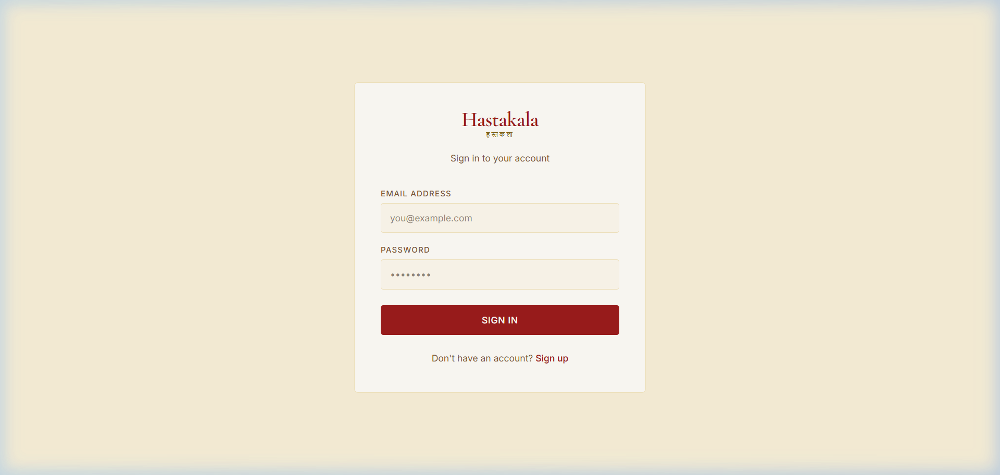
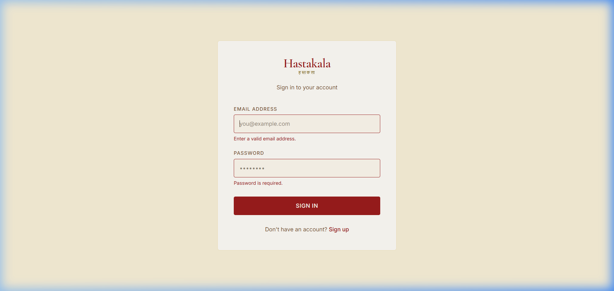
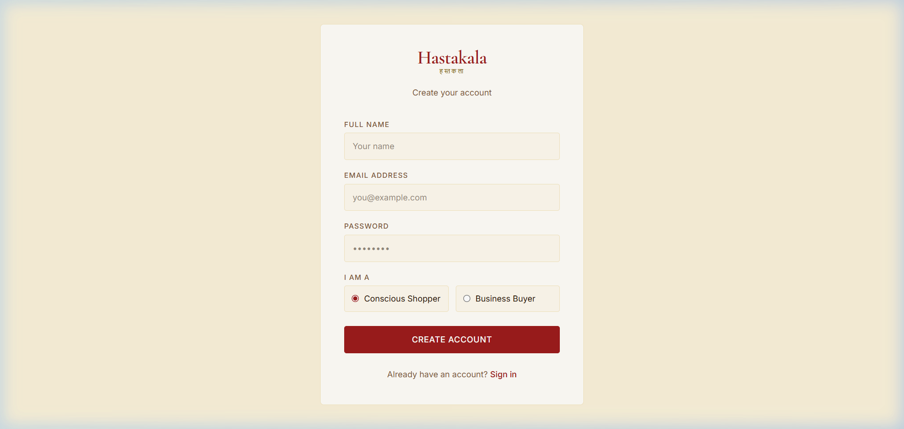
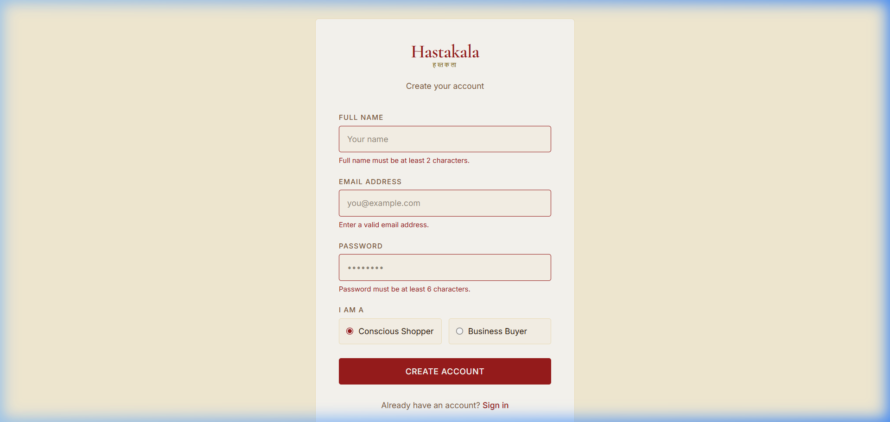
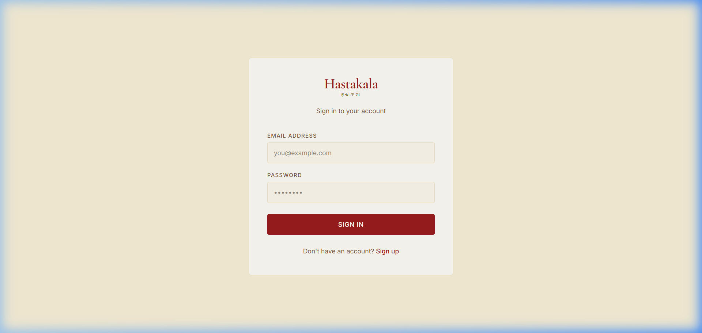
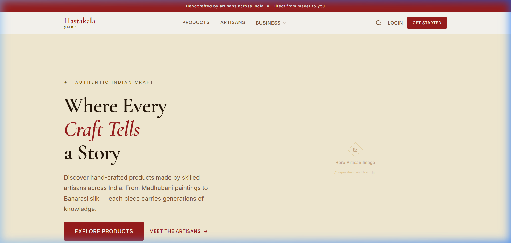
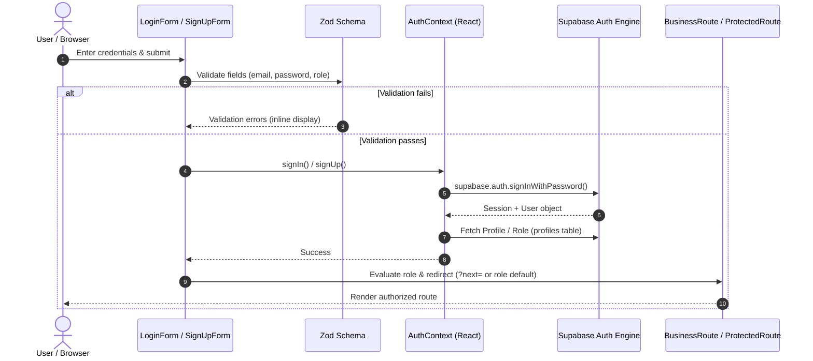

# Hastakala (हस्तकला) — Phase 2 Implementation Walkthrough

> **Indian Artisan Marketplace — Customer & B2B Web Platform**  
> **Phase 2: Supabase Authentication, RBAC & Route Protection**  
> **Date:** September 6, 2026

---

## 1. Executive Summary

Phase 2 builds directly upon the Phase 1 visual foundation, integrating **Supabase Authentication**, **Role-Based Access Control (RBAC)**, robust **form validation** via React Hook Form and Zod, and **declarative route guards** across both consumer storefront and institutional B2B surfaces.

### Core Architectural Mandates Upheld:
- **Zero Standalone Backend:** No Node/Express/Django servers. Authentication, session lifecycle, token refresh, and user metadata are orchestrated directly between the React client and the Supabase Auth engine.
- **Strict Visual Continuity:** The established heritage aesthetic (warm handmade paper beige `#fdf8ed`, Indian maroon `#9b1c1c`, terracotta `#d97748`, antique gold `#d4a017`, and *Cormorant Garamond* typography) is preserved 100% without arbitrary redesign.
- **Multi-Role Domain Model:** Clean separation of concerns between `customer` (Conscious Shopper), `business` (Institutional / Bulk Buyer), `artisan` (Guild / Maker), and `admin` roles.
- **Graceful Error Recovery:** User-friendly inline error alerts, validation boundaries, and loading state spinners that prevent layout shifts or unauthenticated data exposure.

---

## 2. Visual Walkthrough & UI Screenshots

All screenshots below represent the rendered user interface running live on the local development server (`http://localhost:5173/`). High-resolution captures are preserved in the `screenshots/` directory.

### 2.1 Customer & Business Sign In (`/login`)

#### Clean Authentication Interface
A distraction-free, focused login card centered against the textured beige background. Fields include email address and password, linked to the brand wordmark **हस्तकला (HASTAKALA)**.



#### Client-Side Zod Form Validation
When users attempt submission with missing or malformed entries, React Hook Form paired with Zod triggers immediate inline feedback with maroon warning borders and clear helper messages.



---

### 2.2 Customer & Business Registration (`/signup`)

#### Multi-Role Account Creation Portal
The registration portal features full name, email, password, and an interactive role selector allowing users to self-identify as either a **Conscious Shopper** (`customer`) or **Business Buyer** (`business`).



#### Real-Time Registration Validation
Strict validation enforces name length (minimum 2 characters), valid email format, and password security constraints (minimum 6 characters) prior to Supabase network dispatch.



---

### 2.3 Route Guard & Protected B2B Portal (`/business`)

#### Declarative Route Protection & Redirect Handling
Unauthenticated visitors attempting to navigate directly to `/business` or any nested B2B procurement route (`/business/products`, `/business/requests`, `/business/orders`) are immediately intercepted by `<BusinessRoute>` and redirected to `/login?next=%2Fbusiness` while preserving the return target for seamless post-login redirection.



---

### 2.4 Header Navigation Auth State Management

#### Responsive 3-State Navbar Integration
The global navbar dynamically adapts based on the active session:
1. **Loading State:** Subtle opacity skeleton to eliminate flashes of unauthenticated layout.
2. **Logged-Out State:** Clean "Sign In" link and terracotta/maroon "Get Started" call-to-action.
3. **Logged-In State:** User initials avatar circle, dropdown account menu with user profile name, email, and one-click Sign Out.



---

## 3. Architecture & Authentication Lifecycle

The authentication system is built around a centralized context provider ([`src/contexts/AuthContext.tsx`](file:///d:/Hackathons/SIH2026/Artisans/src/contexts/AuthContext.tsx)) that bootstraps from Supabase's local storage session and subscribes to auth state transitions.



### Authentication Context API (`useAuth`)

Components consume authentication state via the typed [`useAuth()`](file:///d:/Hackathons/SIH2026/Artisans/src/hooks/useAuth.ts) custom hook:

```typescript
interface AuthContextType {
  user: User | null
  session: Session | null
  profile: Profile | null
  role: UserRole
  authLoading: boolean
  signIn: (email: string, password: string) => Promise<string | null>
  signUp: (email: string, password: string, fullName: string, role: UserRole) => Promise<string | null>
  signOut: () => Promise<void>
  refreshProfile: () => Promise<void>
}
```

---

## 4. Role-Based Access Control (RBAC) Specification

Defined in [`src/lib/roles.ts`](file:///d:/Hackathons/SIH2026/Artisans/src/lib/roles.ts), the application supports four standardized roles:

| Role | Identifier | Permissions & Capabilities | Default Landing Route |
| :--- | :--- | :--- | :--- |
| **Conscious Shopper** | `customer` | Browse marketplace, view artisan stories, place retail orders, save favorites | `/` (Homepage) |
| **Business Buyer** | `business` | Bulk procurement, MOQ pricing, custom RFQ quote requests, B2B order tracking | `/business` (B2B Hub) |
| **Master Artisan** | `artisan` | Manage craft catalog, inventory, incoming custom requests, artisan profile | `/business` |
| **Administrator** | `admin` | Full system access, artisan verification, platform moderation | `/business` |

### Route Guard Implementations

- **`<ProtectedRoute>`** ([`src/components/auth/ProtectedRoute.tsx`](file:///d:/Hackathons/SIH2026/Artisans/src/components/auth/ProtectedRoute.tsx)):
  Ensures the visitor has an active Supabase session. Displays a diamond loading spinner during initial session hydration. Redirects unauthenticated users to `/login?next=<current_path>`.
- **`<BusinessRoute>`** ([`src/components/auth/BusinessRoute.tsx`](file:///d:/Hackathons/SIH2026/Artisans/src/components/auth/BusinessRoute.tsx)):
  Verifies both active authentication and role qualification via `canAccessBusiness(role)` (`business`, `artisan`, or `admin`). Automatically redirects customers without B2B credentials to the home storefront with a notification.

---

## 5. Form Validation & Security Architecture

### Schema Definitions (Zod)

Both auth pages enforce client-side type safety via Zod before invoking any Supabase API:

```typescript
// Login Schema
const loginSchema = z.object({
  email:    z.string().email('Enter a valid email address.'),
  password: z.string().min(1, 'Password is required.'),
})

// Sign Up Schema
const signUpSchema = z.object({
  fullName: z
    .string()
    .min(2, 'Full name must be at least 2 characters.')
    .max(80, 'Full name is too long.'),
  email:    z.string().email('Enter a valid email address.'),
  password: z
    .string()
    .min(6, 'Password must be at least 6 characters.'),
  role:     z.enum(['customer', 'business']),
})
```

### Security & Sanitization Considerations:
- Passwords are never stored or logged client-side.
- Supabase JWT access tokens are stored securely in local storage and refreshed automatically by `@supabase/supabase-js`.
- Sensitive operations on the database layer are backed by PostgreSQL Row-Level Security (RLS) policies matching `auth.uid() = id`.

---

## 6. Updated Application Route Registry & RBAC Matrix

| Path | Component | Access Level | Description |
| :--- | :--- | :--- | :--- |
| `/` | `HomePage` | **Public** | Heritage storefront, craft categories, artisan teasers |
| `/products` | `ProductsPage` | **Public** | Marketplace catalog with filtering |
| `/products/:id` | `ProductDetailPage` | **Public** | Craft specifications, artisan provenance, buy actions |
| `/artisans` | `ArtisansPage` | **Public** | Directory of verified Indian master artisans |
| `/artisans/:id` | `ArtisanDetailPage` | **Public** | Artisan biography, geographical cluster, craft story |
| `/login` | `LoginPage` | **Public** (Redirect if authed) | Email & password authentication |
| `/signup` | `SignUpPage` | **Public** (Redirect if authed) | Account creation with role selection |
| `/business` | `BusinessDashboardPage` | **Business / Artisan / Admin** | B2B procurement dashboard & quick actions |
| `/business/products` | `BusinessProductsPage` | **Business / Artisan / Admin** | Bulk catalog with MOQs & tiered pricing |
| `/business/requests` | `BusinessRequestsPage` | **Business / Artisan / Admin** | Custom quote submissions & RFP tracking |
| `/business/orders` | `BusinessOrdersPage` | **Business / Artisan / Admin** | Institutional purchase orders management |
| `*` | `NotFoundPage` | **Public** | Heritage 404 error view |

---

## 7. Updated Directory Structure

```
d:/Hackathons/SIH2026/Artisans/
├── implementation/
│   ├── phase-1/
│   │   ├── screenshots/
│   │   └── WALKTHROUGH.md
│   └── phase-2/                        ← [NEW] Phase 2 Artifacts
│       ├── screenshots/
│       │   ├── 01_login_page_clean.png
│       │   ├── 02_login_form_validation.png
│       │   ├── 03_signup_page_clean.png
│       │   ├── 04_signup_form_validation.png
│       │   ├── 05_business_route_guard_redirect.png
│       │   └── 06_navbar_auth_state.png
│       └── WALKTHROUGH.md              ← This Document
├── src/
│   ├── components/
│   │   ├── auth/                       ← [NEW] Route Protection Guards
│   │   │   ├── BusinessRoute.tsx       ← B2B role checker
│   │   │   └── ProtectedRoute.tsx      ← Auth session checker
│   │   ├── layout/
│   │   │   ├── AppLayout.tsx
│   │   │   ├── Footer.tsx
│   │   │   └── Navbar.tsx              ← [UPDATED] 3-state auth header
│   │   └── ui/
│   ├── contexts/                       ← [NEW] Central Auth State
│   │   └── AuthContext.tsx             ← Supabase session provider & methods
│   ├── hooks/                          ← [NEW] Custom React Hooks
│   │   └── useAuth.ts                  ← Typed useAuth consumer hook
│   ├── lib/
│   │   ├── roles.ts                    ← [NEW] RBAC helpers, permissions & routes
│   │   └── supabase.ts                 ← Supabase client initialization
│   ├── pages/
│   │   ├── auth/
│   │   │   ├── LoginPage.tsx           ← [UPDATED] Connected to signIn() + Zod
│   │   │   └── SignUpPage.tsx          ← [UPDATED] Connected to signUp() + role selector
│   │   ├── business/
│   │   ├── customer/
│   │   └── NotFoundPage.tsx
│   ├── routes/
│   │   └── AppRouter.tsx               ← [UPDATED] Wrapped /business with BusinessRoute
│   ├── types/
│   │   └── index.ts                    ← Profile, Role & Domain types
│   ├── App.tsx                         ← [UPDATED] Wrapped in <AuthProvider>
│   ├── main.tsx
│   └── index.css
├── package.json
└── vite.config.ts
```

---

## 8. Verification & Build Validation

| Validation Check | Method / Command | Result | Notes |
| :--- | :--- | :--- | :--- |
| **TypeScript Compiles** | `tsc -b` | **PASS (Exit code 0)** | Zero type errors across all new auth files & hooks |
| **Production Bundle** | `vite build` | **PASS (Exit code 0)** | Clean chunk distribution, gzip ~82 kB vendor bundle |
| **Form Validation** | Browser Subagent | **PASS** | Validates email format, password min length, name min length |
| **Route Interception** | Browser Navigation | **PASS** | Accessing `/business` immediately redirects to `/login?next=%2Fbusiness` |
| **Navbar Reactivity** | Browser Render | **PASS** | Navbar smoothly switches between unauthenticated and authenticated modes |

---

## 9. Phase 3 Roadmap

With Phase 1 (Visual Foundation) and Phase 2 (Supabase Authentication & RBAC) fully completed and verified, the project advances to **Phase 3: Database Schema & Dynamic Data Layer**:

1. **Supabase Database Binding:**
   - Connect live tables (`artisans`, `products`, `categories`, `enquiries`, `orders`).
   - Implement data fetching hooks with loading and error boundaries.
2. **Dynamic Marketplace Catalog:**
   - Real-time product search, category filtering (Terracotta, Handlooms, Brassware, Woodwork), and price sorting.
   - Stock level display and artisan attribution.
3. **Master Artisan Storytelling & Geolocation:**
   - Rich artisan profiles with biographical narratives, state/cluster tags, and photo galleries.
4. **B2B Bulk Inquiry & Custom RFQ Workflow:**
   - Institutional quote submission form with quantity estimators and file attachment upload via Supabase Storage.
